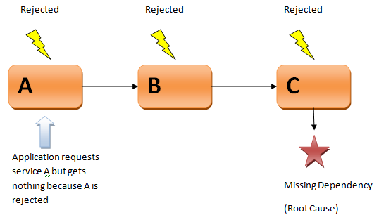
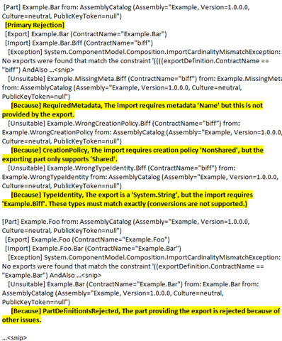

# Diagnosing Composition Problems
## Rejection-Related Problems

One of the implications of Stable Composition is that the rejected parts will simply never show up.

Because parts are interdependent, one broken part can cause a chain of other dependent parts to be rejected as well.

Finding the root cause of a ‘cascading rejection’ like this can be tricky.

Included in the samples under /Samples/CompositionDiagnostics is a prototype diagnostic library that can be used to track composition problems down.

The two basic functions that are implemented allow the rejection state of a part to be inspected, and the contents of an entire catalog to be dumped along with status and root cause analysis information.

### Dump Composition State

For comprehensive diagnostics, the complete composition can be dumped in text format:

{code:vb.net}
Dim cat = New AssemblyCatalog(GetType(Program).Assembly)
Using container As New CompositionContainer(cat)
  Dim ci = new CompositionInfo(cat, container)
  CompositionInfoTextFormatter.Write(ci, Console.Out)
End Using
{code:vb.net}

The output contains many interesting things, including ‘primary rejection’ guesses and analysis of common problems like mismatched type identity, mismatched creation policy, and missing required metadata:

There’s enough information here to correctly diagnose most common issues.

### Find Likely Root Causes

The dump technique above is comprehensive but verbose, and if you have access to the running process in a debugger, the following is more likely to be convenient:

{code:vb.net}
Dim fooInfo = ci.GetPartDefinitionInfo(GetType(Foo))
{code:vb.net}

The return value of CompositionInfo.GetPartDefinitionInfo() is an object that gives quick access to all of the same analytical information as the text dump, but relating to the part Foo. The API exposes:

 * The part’s rejection state (IsRejected) 
 * Whether it is a primary cause of rejection, or if it is rejected because of other cascading rejections (IsPrimaryRejection) 
 * Which parts are likely to be the root causes of the part’s rejection (PossibleRootCauses) 
 * The state of all imports (ImportDefinitions) 
 * For each import, which exports would satisfy the imports (ImportDefinitions..Actuals) 
 * For each import, which other exports with the same contract name were not matched, and the reason for each (ImportDefinitions..UnsuitableExportDefinitions)

## Debugger Proxies

MEF types like ComposablePartCatalog can be inspected under the debugger: 

# The mefx Command-Line Analysis Tool

In Preview 7 and later there is an included utility that makes use of the diagnostics routines to print information about parts directly from the command-line.

{{
C:\Users\...\CompositionDiagnostics> mefx /?

  /?

      Print usage.

  /causes

      List root causes - parts with errors not related to the rejection of other parts.

  /dir:C:\MyApp\Parts

      Specify directories to search for parts.

  /exporters:MyContract

      List exporters of the given contract.

  /exports

      Find exported contracts.

  /file:MyParts.dll

      Specify assemblies to search for parts.

  /importers:MyContract

      List importers of the given contract.

  /imports

      Find imported contracts.

  /parts

      List all parts found in the source assemblies.

  /rejected

      List all rejected parts.

  /type:MyNamespace.MyType

      Print details of the given part type.

  /verbose

      Print verbose information on each part.
}}
The /parts switch list all parts in a composition:

{{
C:\Users\...\CompositionDiagnostics> mefx /dir:..\MefStudio /parts

Designers.CSharp.Commands

Designers.BasicComponentFactory

Designers.CSharpFormFactory

...
}}
While the /rejected and /causes switches will print information about rejected parts and suspected root causes respectively.

By specifying the /verbose switch, detailed information about parts can be retrieved:

{{
C:\Users\...\CompositionDiagnostics> mefx /dir:..\MefStudio /type:Designers.BasicComponentFactory /verbose

[Part](Part) Designers.BasicComponentFactory from: DirectoryCatalog (Path="..\MefStudio")

  [Export](Export) Designers.BasicComponentFactory (ContractName="Contracts.HostSurfaceFactory")

  [Import](Import) Contracts.HostSurfaceFactory.propertyGrid (ContractName="Contracts.IPropertyGrid")

    [Actual](Actual) ToolWindows.PropertyGridWindow (ContractName="Contracts.IPropertyGrid") from: ToolWindows.PropertyGridWindow from: DirectoryCatalog (Path="..\MefStudio")

  [Import](Import) Contracts.HostSurfaceFactory.Commands (ContractName="System.Void(Contracts.HostSurface)")

    [Actual](Actual) Designers.CSharp.Commands.Cut (ContractName="System.Void(Contracts.HostSurface)") from: Designers.CSharp.Commands from: DirectoryCatalog (Path="..\MefStudio")

    [Actual](Actual) Designers.CSharp.Commands.Copy (ContractName="System.Void(Contracts.HostSurface)") from: Designers.CSharp.Commands from: DirectoryCatalog (Path="..\MefStudio")

    [Actual](Actual) Designers.CSharp.Commands.Paste (ContractName="System.Void(Contracts.HostSurface)") from: Designers.CSharp.Commands from: DirectoryCatalog (Path="..\MefStudio")
}}
It is important to realise that the utility can only analyze MEF assemblies built against a compatible version of MEF; for example, mefx.exe built against the CodePlex drops will not be able to analyze assemblies built against the signed .NET Framework version of MEF, and vice-versa.

# Tracing

Diagnostic information produced during composition can be viewed in the Output window of the debugger, or by attaching to the "System.ComponentModel.Composition" trace source.